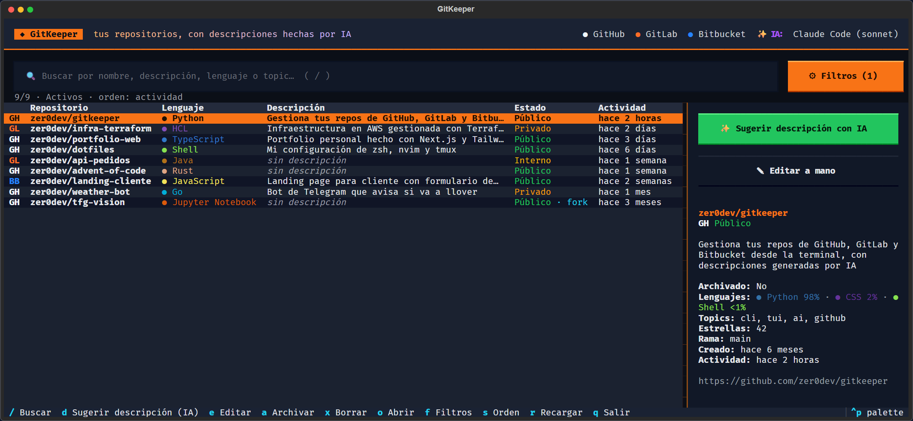
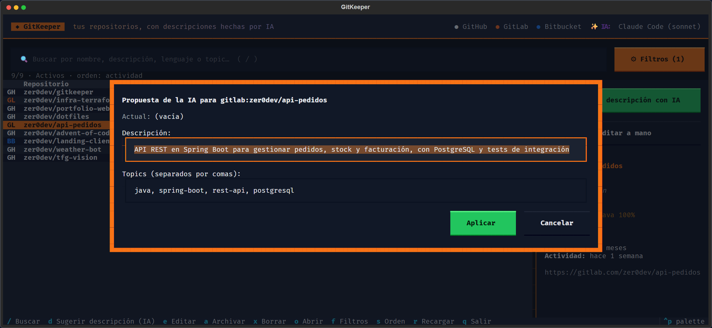

# GitKeeper

Gestiona desde la terminal tus repositorios de **GitHub**, **GitLab** y **Bitbucket**:
lístalos, busca, archiva, borra y, sobre todo, **genera sus descripciones con IA**
(con tu suscripción de Claude, ChatGPT o Gemini, o con API key). Incluye una interfaz interactiva (TUI).



- **Todas tus cuentas en una lista**: GitHub, GitLab (también self-hosted) y Bitbucket Cloud.
- **Descripciones con IA** a partir del README y los ficheros del repo, con topics sugeridos.
  Las revisas y editas antes de aplicarlas.
- **Sin pagar API** si ya tienes Claude Pro/Max, ChatGPT Plus/Pro o cuenta de Google; también
  vale una API key o un modelo local (Ollama, LM Studio…).
- **Mantenimiento rápido**: buscar, filtrar, archivar, borrar y abrir en el navegador, desde la
  TUI o con comandos (`--json` para scripts).

## Instalación

```bash
python -m venv .venv
.venv\Scripts\activate           # Windows  (Linux/macOS: source .venv/bin/activate)
pip install -e ".[ai]"            # CLI + SDKs de Claude, Gemini y OpenAI
# o solo el SDK que uses: pip install -e ".[claude]" / ".[gemini]" / ".[openai]"
```

Esto instala dos comandos equivalentes: `gitkeeper` y `gk`.

## Primeros pasos

```bash
gitkeeper auth login github      # pide el token (oculto) y lo verifica
gitkeeper auth login gitlab --url https://git.miempresa.com/api/v4   # self-hosted
gitkeeper auth login bitbucket   # email de Atlassian + API token
gitkeeper auth status            # qué cuentas e IA están activas

gitkeeper                        # abre la TUI
```

### Credenciales

Por orden de prioridad:

| Plataforma | Variables de entorno | Otras fuentes |
|---|---|---|
| GitHub | `GITKEEPER_GITHUB_TOKEN`, `GITHUB_TOKEN`, `GH_TOKEN` | config, `gh auth token` |
| GitLab | `GITKEEPER_GITLAB_TOKEN`, `GITLAB_TOKEN` | config |
| Bitbucket | `GITKEEPER_BITBUCKET_TOKEN`, `BITBUCKET_TOKEN` (+ `BITBUCKET_USERNAME`/`BITBUCKET_EMAIL`) | config |

Permisos necesarios:

- **GitHub**: token classic con `repo` + `delete_repo`, o fine-grained con *Administration: read & write* y *Contents: read*.
- **GitLab**: Personal Access Token con scope `api`.
- **Bitbucket Cloud**: API token de Atlassian (scopes de repositorio *read/write/admin/delete* y *read:user*) usando tu email como usuario, o un access token de workspace/repositorio (sin usuario; en ese caso configura `bitbucket.workspace`).

### IA: suscripción o API key

**Con suscripción (sin pagar API).** GitKeeper usa la CLI oficial con tu sesión iniciada:

| `ai.provider` | Suscripción | CLI y login |
|---|---|---|
| `claude-code` | Claude Pro / Max | [Claude Code](https://claude.com/claude-code): ejecuta `claude` y `/login`. También sirve el que trae la extensión de VS Code, que se detecta solo |
| `codex` | ChatGPT Plus / Pro | `npm install -g @openai/codex` y `codex login` |
| `gemini-cli` | Cuenta de Google | `npm install -g @google/gemini-cli`, ejecuta `gemini` y "Login with Google" |

En este modo se quitan las variables `*_API_KEY` al lanzar la CLI, para que siempre use la
suscripción. Si la CLI no está en el PATH: `gitkeeper config set ai.cli_path <ruta>`.

**Con API key (pago por uso):**

| `ai.provider` | Clave | Modelo por defecto |
|---|---|---|
| `claude` | `ANTHROPIC_API_KEY` | `claude-opus-5` |
| `gemini` | `GEMINI_API_KEY` / `GOOGLE_API_KEY` | `gemini-flash-latest` |
| `openai` | `OPENAI_API_KEY` | `gpt-5-mini` |

**Selección automática** (`ai.provider = auto`, por defecto), en este orden:

1. La clave guardada para GitKeeper con `gitkeeper config set ai.api_key <clave>` (el proveedor
   se reconoce por el prefijo) o `ai.base_url`.
2. Una suscripción: la primera CLI instalada entre Claude Code, Codex y Gemini CLI.
3. Una API key en variables de entorno.

Para fijarlo: `gitkeeper config set ai.provider claude-code` (o el que quieras). El modelo se
cambia con `ai.model` (en Claude Code valen alias como `sonnet`, `opus` o `haiku`).
`gitkeeper auth status` muestra qué IA se va a usar.

Para modelos locales o APIs compatibles con OpenAI (Ollama, LM Studio, OpenRouter…):

```bash
gitkeeper config set ai.base_url http://localhost:11434/v1
gitkeeper config set ai.model llama3.2
```

La IA recibe el nombre, los metadatos, los ficheros de la raíz y el README (los primeros
12 000 caracteres) y propone una descripción (y hasta 6 topics). El idioma se controla con
`general.language` (por defecto `es`) o con `--lang`.

## Comandos

| Comando | Qué hace |
|---|---|
| `list` | Lista repos. Filtros: `-p github`, `--archived/--active`, `-v private`, `-l python`, `--forks/--no-forks`, `--no-description`, `-s updated\|created\|name\|stars`, `-r`, `-n 20`, `--json` |
| `recent [-n 10] [--all]` | Los de actividad más reciente |
| `latest [-n 10] [--all]` | Los últimos creados |
| `search <palabras>` | Busca en nombre, descripción, lenguaje y topics |
| `show <repo>` | Detalle de un repo |
| `open <repo>` | Lo abre en el navegador |
| `describe <repo>...` | Genera la descripción con IA y te deja aplicar / editar / regenerar / saltar |
| `describe --missing` | Lo mismo para todos los repos activos sin descripción (`-y` para aplicar sin preguntar, `-d` para solo ver) |
| `set-description <repo> "<texto>"` | Cambia la descripción a mano |
| `topics <repo> t1 t2...` | Reemplaza los topics (GitHub y GitLab) |
| `archive / unarchive <repo>...` | Archiva o desarchiva (`-y` sin confirmación) |
| `delete <repo>` | Borra (pide confirmación; `--yes` para no preguntar) |
| `tui` | Interfaz interactiva (también al ejecutar `gitkeeper` sin argumentos) |
| `auth login / status / logout` | Gestión de credenciales |
| `config show / set / unset / path` | Configuración |

Un `<repo>` puede indicarse como `nombre`, `owner/nombre`, `github:owner/nombre`
(`gh:`, `gl:`, `bb:` también valen) o con su URL web.

### TUI

Con `d` (o el botón verde) la IA propone descripción y topics; puedes retocarlos antes de aplicar:



| Tecla | Acción |
|---|---|
| `/` | Buscar (Esc para limpiar) |
| `d` | Generar descripción con IA y revisarla |
| `e` | Editar descripción y topics a mano |
| `a` | Archivar / desarchivar |
| `x` / `Supr` | Borrar (con botón CONFIRMAR) |
| `o` | Abrir en el navegador |
| `f` | Filtros: estado, plataforma, visibilidad, lenguaje, descripción… |
| `s` | Orden: actividad → creación → nombre → estrellas |
| `r` | Recargar |
| `q` | Salir |

## Configuración

`gitkeeper config path` muestra dónde está el fichero (en Windows
`%LOCALAPPDATA%\gitkeeper\config.toml`; se puede cambiar con `GITKEEPER_CONFIG`).

| Clave | Por defecto | Descripción |
|---|---|---|
| `general.language` | `es` | Idioma de las descripciones generadas |
| `github.api_url` | `https://api.github.com` | Para GitHub Enterprise: `https://host/api/v3` |
| `github.affiliation` | `owner,organization_member` | Qué repos listar (añade `collaborator` si quieres) |
| `gitlab.api_url` | `https://gitlab.com/api/v4` | Para instancias self-hosted |
| `gitlab.scope` | `member` | `owned` para ver solo proyectos propios |
| `bitbucket.username` | | Email de Atlassian (vacío para access tokens) |
| `bitbucket.workspace` | | Uno o varios workspaces separados por comas |
| `ai.provider` | `auto` | `auto`, `claude-code`, `codex`, `gemini-cli` (suscripción), `claude`, `gemini`, `openai` (API), `none` |
| `ai.model` | | Sobrescribe el modelo por defecto |
| `ai.api_key` | | Clave de la IA (si no usas variables de entorno) |
| `ai.base_url` | | API compatible con OpenAI |
| `ai.cli_path` | | Ruta de `claude` / `codex` / `gemini` si no están en el PATH |

## Limitaciones por plataforma

- **Bitbucket Cloud** no tiene topics ni permite archivar repositorios por API: esas
  acciones se desactivan o avisan.
- **GitLab** no informa del lenguaje principal en el listado, y el borrado puede quedar
  "pendiente" unos días si la instancia tiene activado el borrado diferido.
- Las descripciones se limitan a 350 caracteres (el máximo de GitHub).

## Desarrollo

```bash
pip install -e ".[ai,dev]"
pytest
```

Los tests no hacen peticiones reales: las APIs de las plataformas se simulan con `respx`
y los SDK y CLIs de IA con clientes falsos.
